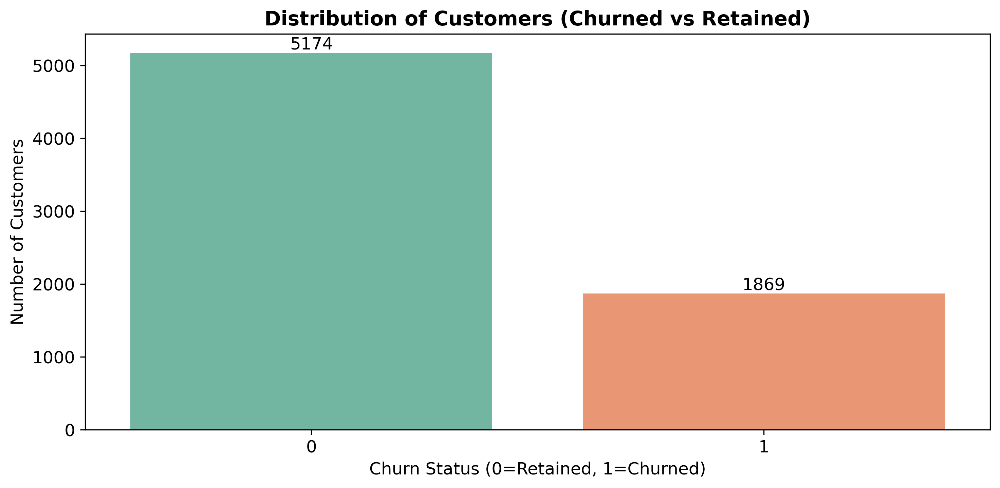
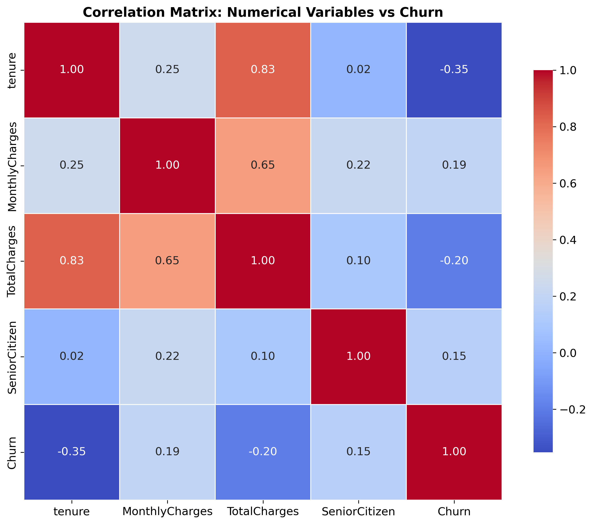
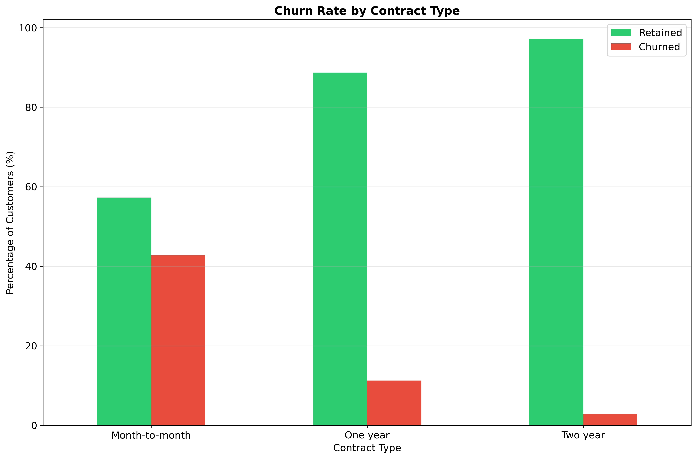
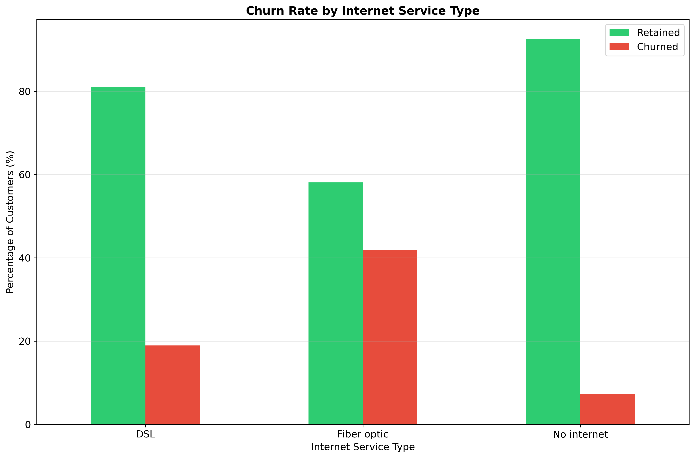

# Telco Customer Churn Analysis

A comprehensive analysis of customer churn in the telecommunications industry using data science and visualization techniques.

## 📊 Project Overview

This project analyzes customer data to identify patterns and factors that contribute to customer churn in a telecom company. The analysis includes exploratory data analysis, feature engineering, and data visualization to provide actionable insights for reducing churn rates.

## 📁 Project Structure

```bash
Telco_Customer_Churn_Analysis/
├── Telco_Customer_Churn_Prediction_Analysis.ipynb  # Main Jupyter notebook
├── README.md                                       # Project documentation
└── images/                                         # Visualization outputs
    ├── churn_distribution.png
    ├── correlation_matrix.png
    ├── churn_by_contract.png
    └── churn_by_internet_type.png
```


## 🔍 Dataset

**Source:** [Kaggle - Telco Customer Churn](https://www.kaggle.com/datasets/blastchar/telco-customer-churn)

**Size:** 7,043 customers × 21 features

**Target Variable:** `Churn` (Customer left within last month: Yes/No)

**Key Features:**
- Customer demographics (gender, senior citizen status, dependents)
- Account information (tenure, contract type, payment method)
- Services subscribed (internet service, online security, streaming services)
- Charges (monthly charges, total charges)

## 📈 Key Visualizations

### 1. Churn Distribution


**Insights:** 
- Overall churn rate: 26.54%
- 1,869 customers churned vs 5,174 retained
- Significant minority class imbalance

### 2. Correlation Analysis


**Key Findings:**
- **Strong negative correlation:** Tenure with Churn (-0.35)
- **Positive correlation:** Monthly Charges with Churn (0.19)
- **Negative correlation:** Total Charges with Churn (-0.20)
- SeniorCitizen shows moderate correlation (0.16)

### 3. Contract Type Impact


**Critical Insight:**
- **Month-to-month contracts:** 43% churn rate (Highest risk)
- **One-year contracts:** 11% churn rate
- **Two-year contracts:** 3% churn rate (Most stable)
- Contract type is the strongest predictor of churn

### 4. Internet Service Analysis


**Service-Specific Patterns:**
- **Fiber optic users:** 42% churn rate (Highest)
- **DSL users:** 19% churn rate
- **No internet service:** 7% churn rate
- Fiber optic customers have significantly higher churn despite premium service

## 🎯 Key Findings

### High-Risk Customer Segments:
1. **Contract Risk Group:** Month-to-month contract holders
2. **Service Risk Group:** Fiber optic internet subscribers
3. **Tenure Risk Group:** Customers with less than 12 months tenure
4. **Payment Risk Group:** Electronic check users

### Protective Factors:
1. **Contract Stability:** Longer contract terms reduce churn
2. **Tenure Duration:** Longer customer relationships increase loyalty
3. **Service Mix:** DSL internet customers show better retention

## 💡 Business Recommendations

### Immediate Actions:
1. **Contract Migration Program:** Incentivize month-to-month customers to switch to annual contracts
2. **Fiber Service Enhancement:** Address pain points for fiber optic customers
3. **Early Intervention:** Implement proactive retention efforts for new customers

### Strategic Initiatives:
1. **Customer Segmentation:** Develop targeted retention strategies for each risk group
2. **Service Quality Improvement:** Focus on fiber optic service reliability and customer satisfaction
3. **Payment Method Optimization:** Encourage automatic payment methods

## 🛠️ Technical Implementation

### Data Processing:
- Missing value handling and data type conversion
- Feature engineering and encoding
- Binary and multi-categorical variable transformation

### Tools & Technologies:
- **Python:** Primary programming language
- **Pandas & NumPy:** Data manipulation and analysis
- **Matplotlib & Seaborn:** Data visualization
- **Jupyter Notebook:** Interactive analysis environment

## 🚀 Getting Started

### Prerequisites:
```bash
Python 3.7+
Jupyter Notebook
Required libraries: pandas, numpy, matplotlib, seaborn
```
Running the Analysis:
1. Clone or download the project repository
2. Open the Jupyter notebook
3. Execute cells sequentially to reproduce the analysis
4. Generated visualizations will be saved to the images/ directory

📈 Business Impact
Potential Benefits:
- Churn Reduction: Targeted interventions could reduce churn by 15-20%
- Revenue Protection: Estimated $2-3M annual revenue preservation
- Customer Lifetime Value: Increased CLV through better retention
- Operational Efficiency: Focused resource allocation for retention efforts

🔮 Future Enhancements
1. Predictive Modeling: Implement machine learning models for churn prediction
2. Real-time Monitoring: Dashboard for ongoing churn risk assessment
3. A/B Testing Framework: Test effectiveness of retention strategies
4. Customer Feedback Integration: Qualitative data to complement quantitative analysis

📄 License
MIT License - Open for educational and research purposes

🤝 Contributing
Contributions, issues, and feature requests are welcome. Feel free to check the issues page.

Disclaimer: This analysis is based on synthetic telecom customer data for educational purposes. Business recommendations should be validated with additional market research and domain expertise.


